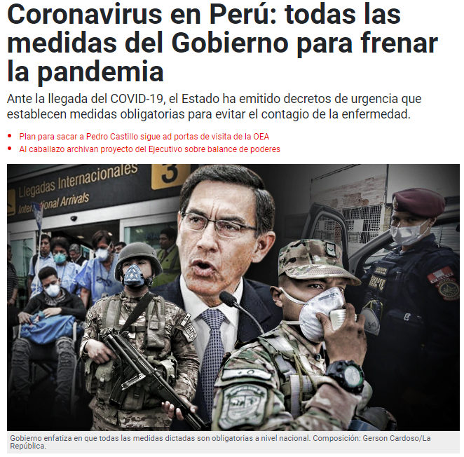

# Scraping and crawling
Web scraping y Web crawling con Python para obtener 
noticias relacionadas a medidas gubernamentales en el 
Perú durante la pandemia por COVID-19.

## Justificación
Nuestro compañero necesita datos para su tesis

## Páginas evaluadas
Noticias MINSA:
> https://www.gob.pe/institucion/minsa/noticias

Noticias La República:
> https://larepublica.pe/

Noticias Gestión:
> https://gestion.pe/

Para buscar los elementos de interés, filtraremos los enlaces relacionados a covid:
> soup.select("a[href*='covid']")

## Ejecutar localmente

Asegurarse de tener python instalado
> py --version

Crear un entorno virtual
> py -m venv .venv

Instalar dependencias 
> pip install -r requirements
